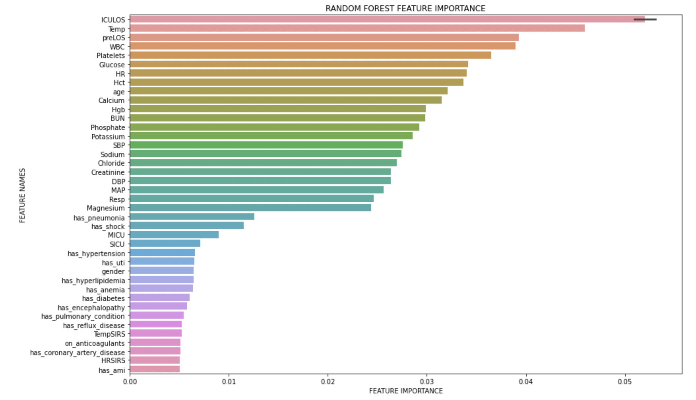
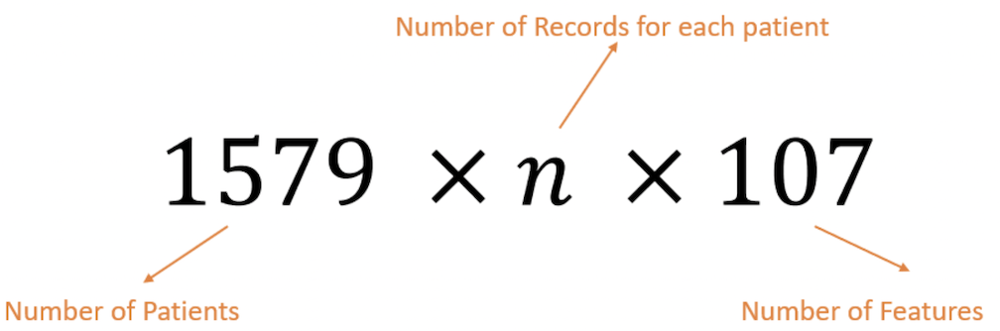
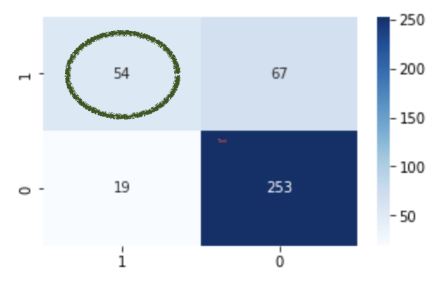
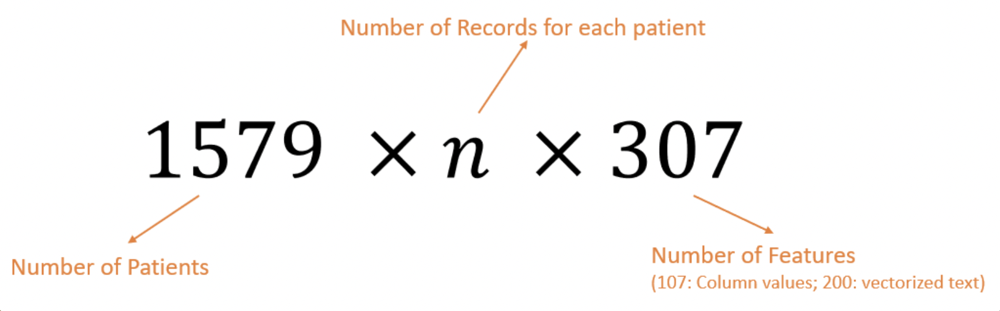
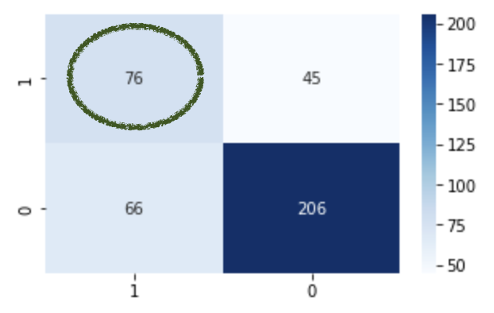

# Representations for Sepsis Prediction

## Table of contents:
1. [Introduction](#intro)
2. [Data Processing](#data)
3. [Experiments](#experiments)
4. [Preliminary Results](#results)
5. [Future Scope](#future)

## Collaborators 
* [Krish Rewanth Sevuga Perumal](https://www.linkedin.com/in/krish-rewanth/)
* Yotam Voskoboynik

### Introduction: 
Predict Sepsis based on time series data and radiology reports from the [MIMIC-IV chest X-ray database](https://physionet.org/content/mimic-cxr/2.0.0/)
* Sepsis is an extreme immune response to an infection.
* ⅓ Hospital Deaths in US
* Over 1.5 million in US/year
* Faster diagnosis/treatment crucial for patient survival 

Compared 3 Models
1. [Baseline: Logistics Regression - Random Forest](#baseline)
2. [Deep Learning (CNN and LSTM) with the structured data](#dl-structured)
3. [Deep Learning (CNN and LSTM) with the structured and report text data](#dl-structured-text)

## Data Processing: 
* Consider all columns from the description 
    * Vital Features - HR, Temp, etc
    * Diagnosis Features - Calcium, Glucose, etc
    * MED Features - on_anticoagulants, etc
    * Comorbidities Features - has_pneumonia, has_shock, etc
    * Other Features - Age, ICULOS, etc
    * Sepsis Labels
    * Patient ID and Time Sequence (0, 1, …) - Only for Deep Learning models (CNN and LSTM)
    * Report TEXT - Required section parsed from the Report
* Reason: We wanted the model to make an informed decision about the relevant features for Sepsis Prediction and compare with standard features
* Dropped columns with more than 20% of NaN values
    * Columns like on_vent, FiO2 has 99% of the data as NaN
    * Number of columns dropped - 32
* Filled any remaining NaN values
    * numeric columns - Mean Imputation
    * TEXT (Report) column - FFILL 
* Dropped rows with NaN values still remaining (Data Dropped: 0.3%)
* Train and Test Data Split while loading the data (Why not randomized split? Data Leakage!)
    * Train Set: 1,579 Patients; 78,596 Records (80% of the patients) 
    * Test Set: 393 Patients; 18,913 Records (20% of the patients)

## Experiments 

### Baseline Model 

Model Used: Random Forest Logistic Regression\
Data: All records concatenated into one dataframe

* Test Sample Size: 18913
* Patients with more data have bigger effect on the model
* High Accuracy,  0.9505 on test set
* But very low PPV,  0.00321

Redid with only features that were important to Sepsis Prediction
* Started with 105 Features, Left with 61
* New Model Accuracy 0.9502
* PPV, 0.0107

  

Features usually used for Sepsis Diagnosis
* Body Temp
* Heart Rate
* Respiratory Rate
* Leukocyte Count

All appear as important features in the model

### Deep Learning with Structured Data 

* Feature Columns - All filtered features after cleaning NaN values and Patient ID, Time and Sepsis Labels
* Sequence Generation for Data:
    * For each patient, select the features and convert the values into list
    * Output Label - max(sepsis labels for patient) i.e. 1 if patient had sepsis else 0
    * Train data shape after sequence generation:

  

* Truncate data for 2nd dimension with [0.0] * len(3rd dimension) 
* Reshape the data for modeling
    * Train: 1579 x 402 x 107
    * Test: 393 x 402 x 107

* Train model with CNN (Accuracy: 0.7481; PPV: 0.2975)
* Train model with **LSTM** (Accuracy: 0.7812; **PPV: 0.4463**)

Confusion Matrix for LSTM Model:

  

### Deep Learning with Structured and Text Data 

* The previous model is appended with patient report (text data).
* The text data is tokenized, cleaned (punctuation and stopwords removed) and then vectorized using pubmed word2vec (200D).
* The vectors are then flattened out by taking the mean of the word vector, so as to maintain consistency with the dimension of the input for the neural network.

  

* Extend vectorized data to the already existing feature vector
* The above data is trained on the same neural network architecture as the previous one.

* Train model with CNN (Accuracy: 0.7761; PPV: 0.5537)
* Train model with **LSTM** (Accuracy: 0.7176; **PPV: 0.6281**)

Confusion Matrix for LSTM Model:

  

## Preliminary Results: 
(Without hyperparameter tuning)

| Model  | Basline (Random Forest) | CNN (Structured Data) | LSTM (Structured Data) | CNN (Structured Data and Report) | LSTM (Structured Data and Report)
| ------------- |:-------------:|:-------------:|:-------------:|:-------------:|:-------------:|
| Accuracy | 0.9502 | 0.7481 | 0.7812 | 0.7761 | 0.7176
| PPV | 0.0107 | 0.2975 | 0.4463 | 0.5537 | 0.6281
| NPV | 0.9989 | 0.9485 | 0.9301 | 0.8750 | 0.7574
| Sensitivity | 0.3448 | 0.7200 | 0.7397 | 0.6634 | 0.5352
| Specificity | 0.9512 | 0.7522 | 0.7906 | 0.8151 | 0.8207

## Future Scope: 

1. Compare the results with different models and feature engineering techniques
    1. Use the standard Sepsis prediction chart to analyze the data
    2. Manually select standard features used for Sepsis Prediction
2. Use different imputation strategies to fill NaN values for numeric features and the Report Text Column.
3. Use different techniques for combining the vectorized features of the the report text with the structured data.

## Thank you!

I hope you found the project useful and interesting. This project was developed as part of the [MED 277 class](https://dbmi.ucsd.edu/education/courses/med277.html) offered by [Michael Hogarth, MD](https://www.hogarth.org/) and [Shamim Nemati, PhD](https://www.nematilab.info/people/shamim/index.html) at the University of California, San Diego.

-- [Rohith S P](https://www.linkedin.com/in/rohithsp/)
